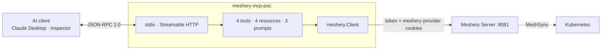

# meshery-mcp-poc

[](https://github.com/singhharsh1708/meshery-mcp-poc/actions/workflows/ci.yml)

A small, read-only [Model Context Protocol](https://modelcontextprotocol.io) server for [Meshery](https://meshery.io), built as a proof-of-concept for the LFX Term 3 2026 "Meshery MCP Server" project ([cncf/mentoring#2019](https://github.com/cncf/mentoring/issues/2019)).

It speaks MCP over **stdio** (default) or **Streamable HTTP** and lets an AI client (Claude Desktop, MCP Inspector, …) read from a local Meshery Server. It exposes:

- **`meshery_list_kubernetes_contexts`**: the entry point for anything cluster-scoped, via `GET /api/system/kubernetes/contexts`
- **`meshery_list_designs`**: lists Meshery designs via `GET /api/pattern`
- **`meshery_list_kubernetes_resources`**: lists MeshSync-discovered Kubernetes resources for one cluster via `GET /api/system/meshsync/resources`
- **`meshery_list_kubernetes_connections`**: lists the Kubernetes cluster connections Meshery is managing via `GET /api/integrations/connections?kind=kubernetes`

Templated resources (RFC 6570), with `resources/subscribe` supported:

- **`meshery://clusters/{cluster_id}/topology`**: the discovered state of a cluster as a graph, components as nodes and relationships as edges
- **`meshery://clusters/{cluster_id}/summary`**: per-kind resource counts for a cluster
- **`meshery://clusters/{cluster_id}/namespaces/{namespace}/workloads`**: resources in one namespace of one cluster
- **`meshery://designs/{design_id}/topology`**: component graph of a saved design

## See it run

```bash
./demo/run.sh
```

Builds the server, starts a mock Meshery serving the real endpoint shapes, and drives the binary through a full MCP session over stdio: handshake, tools, resources, subscriptions and prompts. It paces itself to stay readable, about a minute; `DEMO_PACE=0 ./demo/run.sh` runs it flat out. Every line of [the transcript](docs/DEMO.md) is a genuine JSON-RPC exchange with the process.

A cluster topology read, straight from that run:

```json
{
  "name": "minikube",
  "components": [
    {"id": "n1", "displayName": "productpage",     "component": {"kind": "Deployment"}},
    {"id": "n2", "displayName": "productpage-svc", "component": {"kind": "Service"}},
    {"id": "n4", "displayName": "reviews",         "component": {"kind": "Deployment"}}
  ],
  "relationships": [
    {"id": "e1", "kind": "hierarchical", "subType": "parent"},
    {"id": "e2", "kind": "edge",         "subType": "network"}
  ],
  "evaluated": true,
  "excludedSecrets": 1
}
```

Meshery returned four components. The fourth was a Secret named `db-credentials`, which is why `excludedSecrets` is 1 and why it is not above.

## How it fits together



The client never talks to Meshery and never sees a credential. [Architecture notes](docs/ARCHITECTURE.md) cover the design and the failure modes it guards against.


## Three identifiers, and why the contexts tool comes first

Meshery uses three different identifiers for what a user calls "my cluster", and mixing them up produces empty results rather than errors. `GET /api/system/kubernetes/contexts` returns all three together, which is why `meshery_list_kubernetes_contexts` is the entry point:

| Value | What it addresses |
|---|---|
| `kubernetesServerId` | what MeshSync keys discovered resources on; this is the `cluster_id` every resource here takes |
| `connectionId` | the connection record, used by Meshery's own events and connection APIs |
| `id` (context id) | the deployment target, passed as `?contexts=` when deploying a design |

The cluster-scoped endpoints are also unforgiving about it. `GET /api/system/meshsync/resources` filters with `cluster_id IN (?)` against whatever it is given, so omitting the filter produces an empty `IN` clause and returns nothing at all rather than everything. Its sibling `/resources/summary` requires a cluster too and answers 400 without one, and it spells the parameter differently: a repeated singular `clusterId`, not the JSON-encoded `clusterIds` array the resources endpoint parses.

Prompts (guided read-only workflows):

- **`debug_cluster`**: systematic cluster investigation, steering the model onto the tools and resources this server actually exposes
- **`review_design`**: structured design review weighted toward a chosen concern
- **`compare_designs`**: diff two designs' component graphs

No mutating endpoints are registered. `spec`/`status`/`labels`/`annotations` are never requested from MeshSync, so Secret data and last-applied-config never reach the model, and Secrets are filtered out of every path that returns resources or components. The topology resources report an `excludedSecrets` count so a filtered graph is distinguishable from one that never contained any.

## Build

```bash
go build -o meshery-mcp-poc .
```

Requires Go 1.25+. Depends on `github.com/modelcontextprotocol/go-sdk` v1.7.0 and `github.com/yosida95/uritemplate/v3`, which the SDK also uses and which the resource handlers need to match URI templates.

## Transports

```bash
# stdio (default), for local AI clients like Claude Desktop
./meshery-mcp-poc

# Streamable HTTP (spec 2025-03-26, the transport that superseded HTTP+SSE)
./meshery-mcp-poc -transport http
```

The HTTP mode builds a fresh server per session and validates the `Origin` header (via `http.CrossOriginProtection`) to guard browsers against DNS-rebinding.

It binds `127.0.0.1:8080` by default, deliberately. This server acts with the Meshery credentials of whoever started it, and two things mean a wider bind hands those credentials to the network: the SDK's rebinding guard only engages when the accepting local address is loopback, and `CrossOriginProtection` allows any request that sends no `Origin` or `Sec-Fetch-Site` header, which is every non-browser client. Changing `-addr` to a wildcard address without putting real authentication in front of it lets any host that can reach the port read your Meshery data.

## Point it at a local Meshery

```bash
mesheryctl system start -p docker      # Meshery Server on http://localhost:9081 + Operator + MeshSync
mesheryctl system login                # pick the local "Meshery" provider -> writes ~/.meshery/auth.json
mesheryctl system config minikube      # (or kind|docker-desktop) so MeshSync has cluster data
```

Auth uses the two cookies (`token`, `meshery-provider`) that `mesheryctl system login` writes to `~/.meshery/auth.json`, the same way `mesheryctl` authenticates. Override with `MESHERY_URL` and `MESHERY_TOKEN_PATH`.

Sanity-check the endpoints the server calls:

```bash
curl -s -b "token=$(jq -r .token ~/.meshery/auth.json); meshery-provider=$(jq -r '.["meshery-provider"]' ~/.meshery/auth.json)" \
  http://localhost:9081/api/system/meshsync/resources | jq '.pageSize,.totalCount,(.resources[0]|{kind,apiVersion,metadata})'
```

## Use it from an MCP client

**Claude Desktop**: `~/Library/Application Support/Claude/claude_desktop_config.json`:

```json
{
  "mcpServers": {
    "meshery": {
      "command": "/absolute/path/to/meshery-mcp-poc",
      "env": {
        "MESHERY_URL": "http://localhost:9081",
        "MESHERY_TOKEN_PATH": "/absolute/path/to/home/.meshery/auth.json"
      }
    }
  }
}
```

**MCP Inspector** (second client, easy to screenshot):

```bash
npx @modelcontextprotocol/inspector ./meshery-mcp-poc
```

## Tests

```bash
go test ./... -race
```

62 tests, 77.0% coverage on the server package, 80.7% on the Meshery client and 89.1% on `mesheryfake`. Every guarantee below has a test that fails if it stops holding, verified red-green rather than assumed:

| Guarantee | What breaks without it |
|---|---|
| Secrets excluded on every path | a Secret name reaches the model |
| `kind: "Secret"` refused | the filter is dropped and every other kind is returned as the answer |
| Empty template variables rejected | `meshery://clusters//topology` returns every cluster as one |
| `clusterIds` sent as a JSON array | the handler matches zero rows and the cluster looks empty |
| `evaluated` derived, never hardcoded | a failed evaluation reads as a graph with no edges |
| Design file spellings and shapes | a current Meshery returns an empty design with no error |

Unit tests cover request paths, cookie auth, response parsing, and Secret exclusion on every path that returns resources or components, including both topology paths (`meshery/client_test.go`, `meshery/topology_test.go`). They also assert positive controls on the query itself, so a dropped `namespace`, `clusterIds` or `asDesign` parameter fails the build rather than passing silently, and that `spec`/`status`/`labels`/`annotations` are never requested.

End-to-end tests (`server_test.go`, `resources_test.go`, `prompts_test.go`) wire the MCP server to a client over the SDK's in-memory transport and drive it against a mock Meshery, covering the tools, the templated resources, subscriptions and the prompts. `fake_e2e_test.go` runs the same surface against [`mesheryfake`](mesheryfake/) instead, and then asserts on what reached Meshery.

## mesheryfake

[`mesheryfake`](mesheryfake/) is a fake Meshery Server for testing Meshery clients, written to be lifted out of this repository. It reproduces the real API's behaviour on the endpoints an MCP server reads, including the several that answer a wrong request with `200 OK` and nothing in it, and lets a test assert on the request the client sent rather than only on the response it got back.

```go
fake := mesheryfake.New(t)
client := myclient.New(fake.URL(), fake.Token, fake.Provider)
// ... drive the client ...
fake.AssertAuthenticated(t)
fake.AssertClusterScoped(t, "/api/system/meshsync/resources", fake.Data().ClusterID())
fake.AssertZeroBasedPaging(t, "/api/pattern")
```

A hand-written mock returns the shape the code under test expects, so it agrees with the code even where the code is wrong about Meshery. `./mesheryfake/mutation_check.sh` measures the difference: it breaks this repository's Meshery client three ways and reports which suites notice.

| Mutation applied to the client | Hand-written MCP mock | Client tests | `mesheryfake` |
|---|---|---|---|
| cluster filter dropped from the query | passes | catches | catches |
| pages requested one-based | passes | passes | catches |
| bearer header instead of the cookies | passes | catches | catches |

The middle row is the one that matters. Meshery's pagination is zero-based on both of its offset paths, so a client that opens at page 1 skips the first page of every list it reads, and nothing in a suite written without prior knowledge of that catches it. The other two rows are caught by a client test only because a positive control for that exact query was hand-written after the bug had already been found the hard way. The package turns each of those controls into one line, so the next author does not have to know the trap first.

## Topology

The cluster topology resource is built on `GET /api/system/meshsync/resources?asDesign=true`, which makes Meshery render discovered cluster state as a design and run it through the relationship evaluator. The `design` field of the response is a `PatternFile`: its `components` are the graph's nodes and its `relationships` are its edges.

Three things that shape the implementation, all from `server/handlers/meshsync_handler.go`:

- `asDesign` is undocumented and absent from Meshery's `openapi.yml`, so it is treated here as an internal API that can move.
- When it is set, the server clears the flat `resources` list. You get the graph or the list, never both in one call.
- Evaluation runs at depth 1 with no timeout guard, and on failure the server falls back to the un-evaluated design and still returns 200. An empty `relationships` array therefore means "no edges were derived or evaluation failed", never a confirmed empty graph, which is why the resource reports an explicit `evaluated` field rather than presenting empty edges as healthy.

MeshSync exposes no push channel for topology deltas, so subscriptions are poll-and-notify: the server tracks subscribed URIs and a real deployment re-reads them and sends `notifications/resources/updated` when content changes.

## Scope

This is a deliberately small vertical slice of the funded project: the Go REST client + cookie auth, the MCP tool/resource registration pattern (`mcp.AddTool` with struct-tag input schemas, `ReadOnlyHint` annotations), both transports (stdio and Streamable HTTP), CI, tests, and the read-only/secret-exclusion posture. It is not the full server, the funded work adds the registry/environments/perf tool surfaces, prompts, and mutating tools behind `--allow-mutations`.

## What this has and has not been tested against

Verified: the MCP protocol surface, against the compiled binary over stdio with a real client; every Meshery request shape, against the handlers in `meshery/meshery` at current master; the security guarantees, red-green.

Not verified: behaviour against a live Meshery Server with a real cluster attached. The demo uses a mock serving the real payload shapes. Meshery ships an amd64-only image that crashes under emulation on arm64 during content seeding, so a live run has not been possible here. Worth stating plainly rather than implying more coverage than exists.

## License

[Apache License 2.0](LICENSE), matching Meshery, so any of this can be folded into [meshery-extensions/meshery-mcp-server](https://github.com/meshery-extensions/meshery-mcp-server) as-is.
