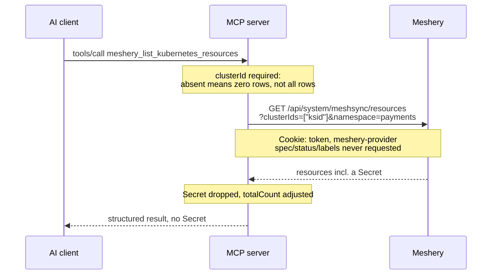
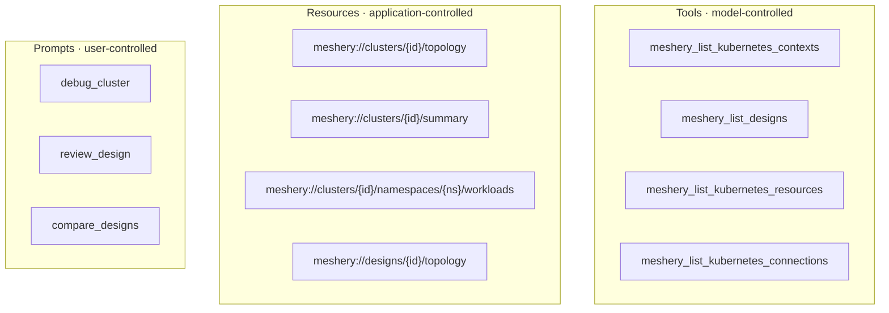

# Architecture

This is a read-only MCP server that lets an AI client query a Meshery instance.
One process, one outbound dependency, and no state of its own beyond a set of
subscribed resource URIs.

Most of what follows is not about MCP. The protocol side is small and the SDK
does the heavy lifting. The interesting part is Meshery's API, which has a
handful of endpoints that answer 200 with something other than what you asked
for, and getting those wrong produces confident nonsense rather than an error.

## Shape

```mermaid
flowchart LR
    subgraph client["AI client"]
        C["Claude Desktop<br/>MCP Inspector"]
    end

    subgraph server["meshery-mcp-poc"]
        direction TB
        T["Transports<br/>stdio · Streamable HTTP"]
        R["Registry<br/>4 tools · 4 resources · 3 prompts"]
        M["meshery.Client<br/>cookie auth · Secret exclusion"]
        T --> R --> M
    end

    subgraph meshery["Meshery Server :9081"]
        direction TB
        A["/api/pattern"]
        B["/api/system/meshsync/*"]
        D["/api/integrations/connections"]
        E["/api/system/kubernetes/contexts"]
    end

    C <-->|"JSON-RPC 2.0"| T
    M -->|"HTTPS + token,<br/>meshery-provider cookies"| meshery
    meshery -.->|"MeshSync discovery"| K["Kubernetes cluster"]
```

The client never talks to Meshery and never sees a credential. Everything
outbound goes through `meshery.Client`, which holds the session cookies read from
`~/.meshery/auth.json`. Tools never build their own requests, so when the auth
story changes, and it will, nothing above the client has to move.

## Why this is a client and not an adapter

Worth stating early because it drives the deployment question.

Meshery adapters are gRPC servers. Meshery dials out to them, which is why they
need no credential of their own and why Meshery is willing to hand them the
user's kubeconfigs. An MCP server is the other way round: it calls Meshery, so it
needs a credential, and the only inbound credential Meshery accepts is a session
cookie minted by an interactive browser login. No service account, no API key, no
machine identity. Meshery's own `HandlerInterface` comment admits a mechanism for
external systems does not exist yet.

So this runs next to the user's AI client, where `mesheryctl system login` has
already written a token. Running it as a deployed service would mean holding
somebody's personal session, which is a different and worse problem.

## Request path

## Three identifiers, one cluster

This one cost the most time, so it goes near the top.

Meshery has three different IDs for what a user calls "my cluster". They look
alike, none are interchangeable, and using the wrong one returns an empty result
rather than an error.

| Value | What it addresses | Where you get it |
|---|---|---|
| `kubernetesServerId` | what MeshSync keys discovered resources on | `GET /api/system/kubernetes/contexts` |
| `connectionId` | the connection record, used by connection and event APIs | same call |
| context `id` | the deployment target, passed as `?contexts=` | same call |

`meshery_list_kubernetes_contexts` exists purely because that endpoint is the
only one returning all three together. It is the entry point for every
cluster-scoped tool and resource here, and the `debug_cluster` prompt starts
there for the same reason.

## Surface

Topology is a resource rather than a tool on purpose. An agent should be able to
attach cluster state as context without that counting as an action. Every tool
carries `ReadOnlyHint` so a client can auto-approve it, which is worth setting
explicitly because mcp-go's `NewTool` otherwise defaults tools to
`destructiveHint: true`.

## Where the topology graph comes from

There is no topology endpoint. What there is, is an undocumented `asDesign=true`
parameter on the MeshSync resources route, which makes Meshery render whatever it
has discovered as a design and run it through the relationship evaluator. The
resulting `PatternFile` has `components` for nodes and `relationships` for edges,
which is exactly a graph.

Four things about that path, all from reading `meshsync_handler.go`:

Setting it clears the flat resource list, so you get the graph or the list and
never both. Evaluation runs at depth 1, where the dedicated evaluate route uses
5, so fewer derived relationships come back. There is no timeout guard, and a
whole-cluster evaluation is not cheap.

And the one that matters: if evaluation fails, the handler logs it, falls back to
the un-evaluated design, and still returns 200. So an empty `relationships` array
means either "no edges" or "evaluation broke", with nothing to distinguish them.
That is why the resource carries an explicit `evaluated` field instead of letting
a caller assume.

It is also absent from Meshery's OpenAPI spec, so it is isolated behind one
client method on the assumption it can move.

## Not leaking Secrets

Four separate things, because one of them was not enough.

`spec`, `status`, `labels` and `annotations` are never requested, so Secret
payloads are not serialized server-side to begin with. Secret objects are then
filtered out of every path that returns resources or components, and that
includes both topology graphs, which is where an earlier version leaked them: the
flat list filtered correctly while the graph did not. The topology resources
report `excludedSecrets` so a filtered graph is distinguishable from one that
never had any.

Asking for `kind: "Secret"` is refused outright. The first version dropped the
`kind` filter when it saw `Secret`, which quietly turned "list the Secrets" into
an unfiltered dump of everything else, presented as the answer. Failing open on a
guard is worse than not having the guard.

Empty URI template variables are rejected. `meshery://clusters//topology` matches
the template with an empty variable, and an empty cluster id drops the filter and
returns every cluster labelled as one. Now a not-found.

## The HTTP transport binds loopback

`-addr` defaults to `127.0.0.1:8080` and that default is load-bearing.

The SDK's DNS-rebinding guard only engages when the accepting local address is
loopback, so a wildcard bind skips it entirely. Go's `CrossOriginProtection`
allows any request that arrives with no `Origin` or `Sec-Fetch-Site` header,
which is every non-browser client. Put those together and a wildcard bind hands
anything on the network a server that acts with your Meshery credentials. That
was verified by driving it from a non-loopback address with a forged `Host` and
reading design data back.

Widening it is a deliberate act, and wants real authentication in front of it.

## Failure modes it will not pass along

Meshery has several endpoints where the honest answer and the empty answer look
identical. The server distinguishes them rather than forwarding the ambiguity:

- Relationship evaluation failing while still returning 200, covered above.
- The design file arriving as a JSON string under `patternFile` on current
  releases and `pattern_file` on older ones. Decoding one spelling gives you a
  design with no components and no error. All four spellings and both shapes are
  accepted, and a missing design file is an error.
- `cluster_id IN (?)` with an empty list, which matches nothing. The cluster id
  is required rather than optional so this fails in the client.
- Unauthenticated calls being redirected to a login page rather than answering
  401, so a client following redirects fails in the JSON decoder. Errors carry
  Meshery's own message so the cause is legible.

The general rule: an empty result and a failed query should never look the same
to whatever is reading them, and here that reader is a language model that will
happily narrate either one as fact.

## What has not been verified

The protocol surface is exercised against the compiled binary over stdio, and
every Meshery request shape is checked against the handlers in `meshery/meshery`
at master. The security guarantees have red-green tests.

What has not happened is a run against a live Meshery with a real cluster
attached. `demo/` uses a mock that serves the real payload shapes, including the
awkward ones. Meshery ships an amd64-only image that crashes during content
seeding under emulation on arm64, so a live run has not been possible on this
machine. Worth knowing before quoting any of this as proven end to end.
