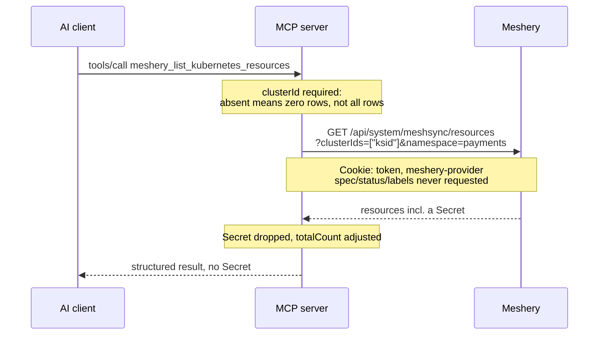
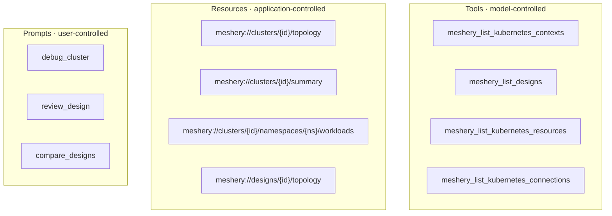

# Architecture

A read-only Model Context Protocol server that lets an AI client query a Meshery
instance. It is deliberately small: one process, one outbound dependency, no
state of its own beyond a subscription set.

## Shape

```mermaid
flowchart LR
    subgraph client["AI client"]
        C["Claude Desktop<br/>MCP Inspector"]
    end

    subgraph server["meshery-mcp-poc"]
        direction TB
        T["Transports<br/>stdio · Streamable HTTP"]
        R["Registry<br/>4 tools · 4 resources · 3 prompts"]
        M["meshery.Client<br/>cookie auth · Secret exclusion"]
        T --> R --> M
    end

    subgraph meshery["Meshery Server :9081"]
        direction TB
        A["/api/pattern"]
        B["/api/system/meshsync/*"]
        D["/api/integrations/connections"]
        E["/api/system/kubernetes/contexts"]
    end

    C <-->|"JSON-RPC 2.0"| T
    M -->|"HTTPS + token,<br/>meshery-provider cookies"| meshery
    meshery -.->|"MeshSync discovery"| K["Kubernetes cluster"]
```

The client never talks to Meshery and never sees a credential. The server holds
the session cookies read from `~/.meshery/auth.json` and is the only component
that makes outbound calls.

## Why a client, not an adapter

Meshery adapters are gRPC *servers* that Meshery dials out to, so they need no
credential of their own and Meshery hands them the user's kubeconfigs. An MCP
server sits on the other side of that relationship: it is a client of Meshery's
REST API, so it does need a credential, and the only inbound credential Meshery
accepts is a per-user session cookie minted by an interactive login. There is no
service account or machine identity.

That is why this runs next to the user's AI client, where `mesheryctl system
login` has already written a token, rather than as a deployed service holding
somebody's session.

## Request path

## The three identifiers

The single most common way to get wrong-but-plausible answers out of Meshery is
to confuse these. They all describe "my cluster" and none are interchangeable.

| Value | Addresses | Where it comes from |
|---|---|---|
| `kubernetesServerId` | what MeshSync keys discovered resources on | `GET /api/system/kubernetes/contexts` |
| `connectionId` | the connection record, used by events APIs | same call |
| context `id` | the deployment target, passed as `?contexts=` | same call |

`meshery_list_kubernetes_contexts` exists to return all three together, which is
why every cluster-scoped tool and resource starts there.

## Surface

Topology is a resource rather than a tool because an agent should be able to
attach cluster state as context without performing an action. Every tool carries
`ReadOnlyHint`, so a client can auto-approve them.

## Security posture

Four things hold at once, and each has a test that fails if it stops holding.

**Secrets never leave.** `spec`, `status`, `labels` and `annotations` are never
requested, so Secret payloads are not serialized server-side in the first place.
Secret objects are then filtered from every path that returns resources or
components, including both topology graphs, and `excludedSecrets` reports the
count so a filtered graph is distinguishable from an empty one.

**Asking for Secrets is refused, not widened.** An earlier version dropped the
`kind` filter when it saw `Secret`, which turned "list the Secrets" into an
unfiltered dump of everything else presented as the answer. It now errors before
any request is made.

**Empty template variables are rejected.** `meshery://clusters//topology` matches
the URI template with an empty variable, and an empty cluster id drops the filter
and returns every cluster. That is now a not-found.

**The HTTP transport binds loopback.** The SDK's DNS-rebinding guard only engages
when the accepting local address is loopback, and Go's `CrossOriginProtection`
allows any request with no `Origin` header, which is every non-browser client. A
wildcard bind would hand the user's Meshery credentials to the network.

## Failure modes it refuses to paper over

Meshery has several endpoints that answer 200 with data that means something
other than it appears to. The server surfaces these rather than passing them on:

- Relationship evaluation can fail and still return 200 with an un-evaluated
  design, so empty `relationships` is ambiguous. The `evaluated` flag says which
  it was.
- The design file arrives as a JSON string under `patternFile` on current
  releases and `pattern_file` on older ones. Decoding one spelling only yields an
  empty design with no error, so all four spellings and both shapes are accepted
  and a missing design file is an error.
- Meshery redirects unauthenticated API calls to a login page rather than
  answering 401, so a naive client fails in the JSON decoder. Errors carry
  Meshery's own message so the cause is legible.
