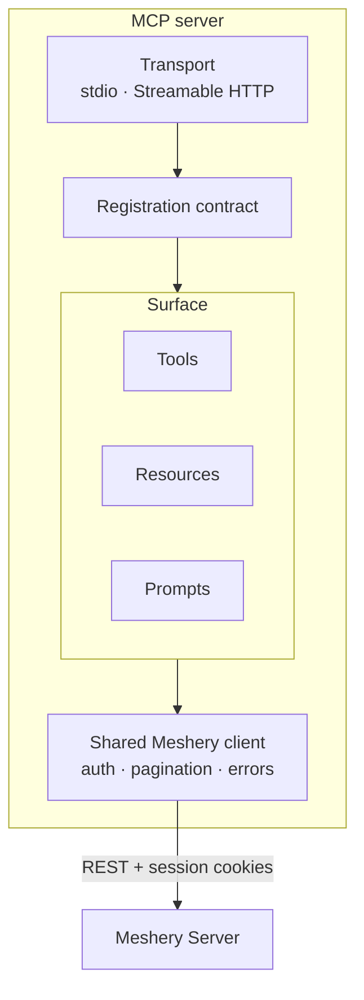

# Implementation plan: Meshery MCP Server

A plan for building the MCP server described in
[cncf/mentoring#2019](https://github.com/cncf/mentoring/issues/2019), written
against the Meshery API as it actually behaves rather than as documented. Every
constraint below was verified against `meshery/meshery` at master; the ones that
cost the most time are called out because they fail quietly rather than loudly.

## 1. What the server is

An MCP server that lets an AI client read and eventually operate a Meshery
instance. It is a **client of Meshery's REST API**, not a Meshery adapter.

That distinction drives everything else. An adapter is a gRPC server that Meshery
dials out to; it needs no credential of its own, and Meshery hands it the user's
kubeconfigs. An MCP server calls Meshery, so it needs a credential, and the only
inbound credential Meshery accepts is a per-user session cookie minted by an
interactive login. There is no service account or machine identity, and Meshery's
own `HandlerInterface` comment acknowledges that a mechanism for external systems
does not exist yet.

Consequences for the MVP:

- The server runs next to the user's AI client, where `mesheryctl system login`
  has already written a token, rather than as a deployed service holding somebody
  else's session.
- Credentials never appear in tool inputs. Cluster registration stays a human
  action; tools reference already-configured connections by ID.
- Meshery ecosystem conventions worth adopting (MeshKit logging and errors,
  shared schemas, Docker and CI layout) are separable from the adapter lifecycle,
  which is not applicable.

## 2. Scope

**In scope for the MVP.** Read-only tools and resources over designs, the model
and component registry, Kubernetes connections and MeshSync-discovered state;
guided prompts; stdio transport, with Streamable HTTP behind a flag.

**Out of scope initially.** Mutating operations (deploy, undeploy, connect,
performance runs), which land behind an explicit opt-in once the read surface is
stable. Live streaming, since MeshSync exposes no push channel for resource
deltas.

**Explicitly not possible today**, and worth not promising:

| Asked for | Reality |
|---|---|
| Kubernetes cluster events | MeshSync does not sync Event objects. Its pipeline entry is singular so the informer watches a path that does not exist, and `ParseList` drops `reason` and `message` anyway. Filed as meshery/meshsync#599. |
| `switch_workspace` | Meshery has no server-side active-workspace concept. Can only be MCP-server-local state. |
| `delete_performance_test` | Results routes are GET only. `DELETE` exists on profiles, which is a different thing. |
| Performance run IDs to poll | The run route is a blocking SSE stream and the caller supplies the UUID. |
| Nighthawk-based load tests | Nighthawk was removed. Fortio is the only generator. |

## 3. Architecture

One shared client owns the base URL, the cookie pair, pagination and error
translation. Tools never build requests themselves, so authentication can change
without touching the surface. Everything registers through one contract so a new
tool, resource or prompt is a single file rather than server wiring.

## 4. API constraints that shape the design

These are the ones that return plausible-but-wrong data rather than an error.
Each needs a guard and a test.

**Authentication is cookies.** `RemoteProvider.GetToken` reads only the `token`
cookie; `mesheryctl` sends `token` plus `meshery-provider`. No route reads an
`Authorization` header. The local provider's `GetSession` returns nil
unconditionally, so a bearer-only client appears to work in local development and
fails the moment a remote provider is used.

**Cluster scoping is mandatory and asymmetric.**
`GET /api/system/meshsync/resources` filters with `cluster_id IN (?)`, so an
absent `clusterIds` produces an empty `IN` clause and returns nothing rather than
everything, and it must be a JSON-encoded array in one parameter. Its sibling
`/resources/summary` requires a cluster too, answers 400 without one, and spells
it as a repeated singular `clusterId`.

**Three identifiers describe one cluster.** `kubernetesServerId` keys MeshSync
data, `connectionId` keys connection and event APIs, and the K8sContext `id` is
the deploy target. `GET /api/system/kubernetes/contexts` returns all three, which
is why the contexts tool is the entry point for everything cluster-scoped.

**Designs are strings, not objects.** `MesheryPattern.PatternFile` is a JSON
string under `patternFile` on current releases and `pattern_file` on older ones.
Decoding one spelling yields an empty design with no error.

**Topology comes from an undocumented parameter.** There is no `/topology` route.
`?asDesign=true` makes Meshery render discovered state as an evaluated design
whose components are nodes and relationships are edges. It clears the flat
resource list, evaluates at depth 1, has no timeout guard, and on evaluation
failure falls back to the un-evaluated design while still returning 200, so empty
relationships is ambiguous and must be reported as such.

**Org scoping.** Environment and workspace routes reject any request without
`orgId`. An org comes from `GET /api/identity/orgs`.

**Registry is unauthenticated.** Every `/api/registry/*` route is `NoAuth`, which
makes it the one surface testable without a login, and a good first tool target.

## 5. Phases

**Phase 1, foundation.** Scaffold, shared client with cookie auth and org
resolution, registration contract, CI. Exit criteria: a tool can be added in one
file; the client is covered by tests that assert what was *sent*, not just what a
permissive mock returned.

**Phase 2, read surface.** Designs, registry, connections and contexts as tools;
cluster topology, namespace workloads and design graphs as resources. Exit
criteria: every guarantee has a red-green test; no endpoint is called without the
parameters it requires.

**Phase 3, agent ergonomics.** Prompts encoding the traps above, output shaping
so large registry and MeshSync payloads do not exhaust a context window,
structured errors a model can act on. Exit criteria: an agent can answer "what is
in my cluster and how is it wired" without a human correcting its reasoning.

**Phase 4, mutations, gated.** Deploy, undeploy and performance runs behind an
explicit opt-in, driven off tool annotations so `--read-only` is one mechanism
rather than a second list to forget.

## 6. Testing

The failure mode to design against is a test that passes because the mock is
permissive. Three rules:

1. Assert on the outbound request, not only the parsed response. A dropped
   `clusterIds`, `namespace` or `orgId` must fail the build.
2. Prove each guard red-green: remove the guard, watch the test fail, restore it.
3. Drive the real binary over a real transport at least once, so protocol
   regressions surface. `demo/run.sh` in this repo does that in about ten seconds.

## 7. Risks

**The protocol revision.** The current MCP specification is `2026-07-28`, which
removes the `initialize` handshake, makes `server/discover` mandatory and replaces
`resources/subscribe` with `subscriptions/listen`. Those are exactly the parts a
registration contract abstracts, so the SDK choice should be deliberate before the
contract lands. Raised as meshery-extensions/meshery-mcp-server#42.

**Context exhaustion.** Meshery's registry spans hundreds of models and MeshSync
dumps can be large. Compact projections by default, with an opt-in for detail.

**Identifier confusion.** The three cluster identifiers produce empty results
rather than errors when mixed up. The contexts tool and explicit parameter naming
are the mitigation.

**Undocumented surface.** `asDesign` is absent from Meshery's OpenAPI spec, so it
should be isolated behind one client method and treated as an internal API that
can move.

## 8. Reference implementation

The proof of concept in this repository implements phases 1 to 3 in miniature:
four read-only tools, four resources including three URI templates with
subscriptions, three prompts, both transports, CI, and tests for every guarantee
listed above. It exists to make the constraints in section 4 concrete rather than
theoretical, and its limitations are stated in the README.
